# Beer-Bar-And-Pizza
## Description
A web application built for a business who sell pizza and beer where it enables the user to order for pick up or delivery. Interactions made can be done as a guest or after creating an account. 
AS A beer and pizza lover
I WANT TO able to order both these items from the same place
SO THAT I can easily enjoy my purchases arriving at the same time without hassle

## Installation
In order to be able to run the app after being cloned you need to run, using node
```
npm i
```
Once node is installed, log in to mysql and run the following commands to initiate the database:
```
source db/schema.sql
```
Then to populate seed data and run it the application you can use
```
npm run seed
node server.js
```

## Live application link
You can view the live application at: https://beerandpizza.herokuapp.com/
 
## GitHub
To visit our GitHub repository visit: https://github.com/Ishan-Wijesingha99/Beer-Bar-And-Pizza

## Contributors

List of contributors is as followed:<br /> 
[Ishan Wijesingha](https://github.com/Ishan-Wijesingha99)<br />
[Mina Ghaly ](https://github.com/Master20100)<br />
[Sudheer Kandula](https://github.com/sudheer313)<br />
[James Little](https://github.com/Jamlit37)

## Screenshots of Application
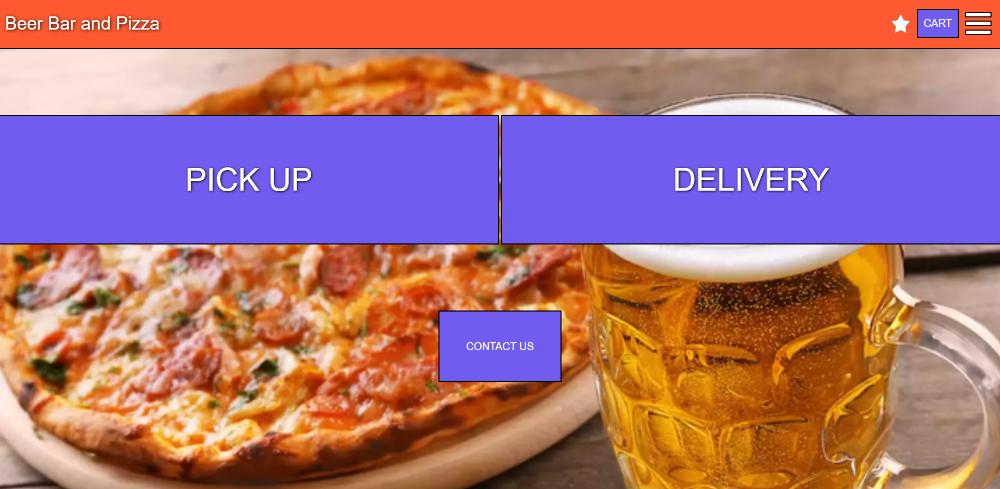
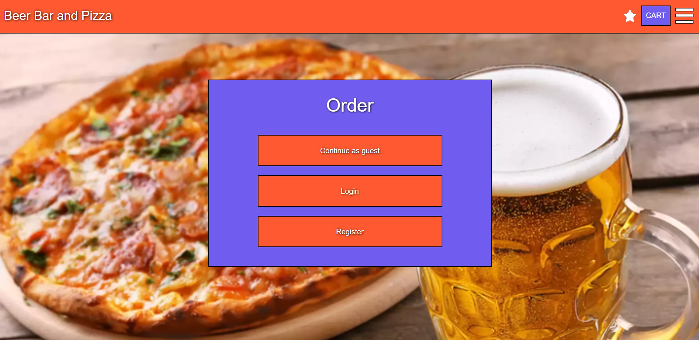
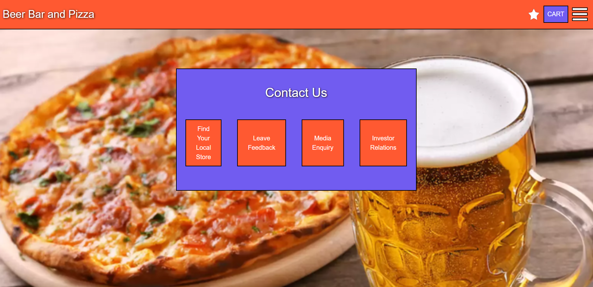
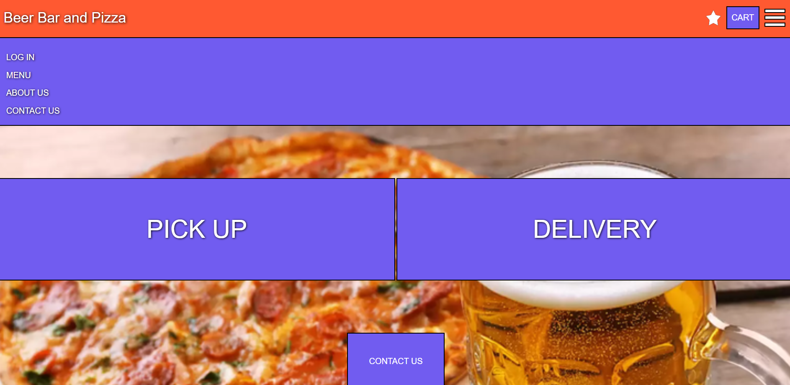
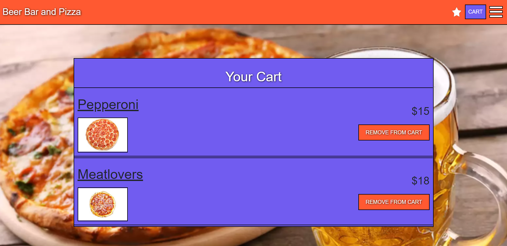
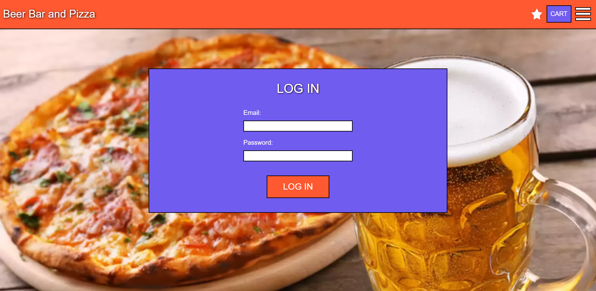
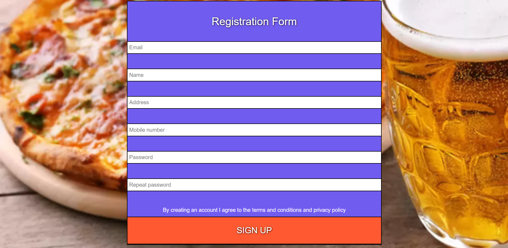
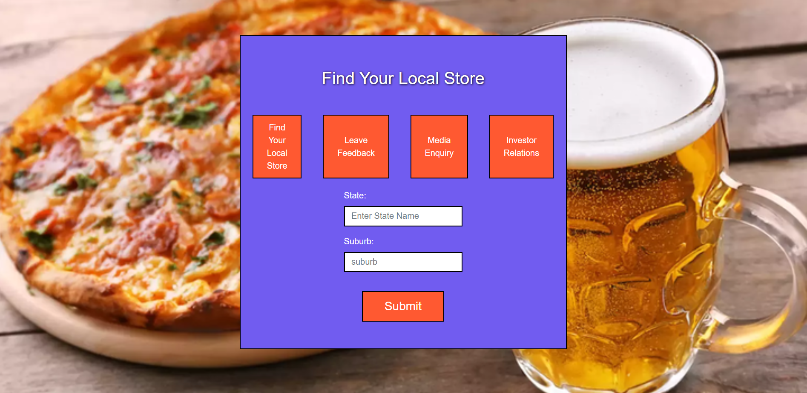
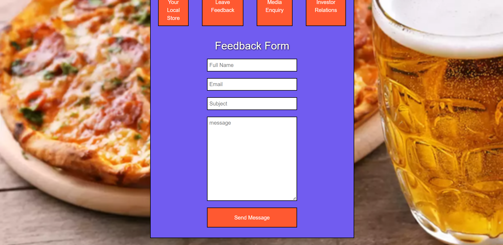
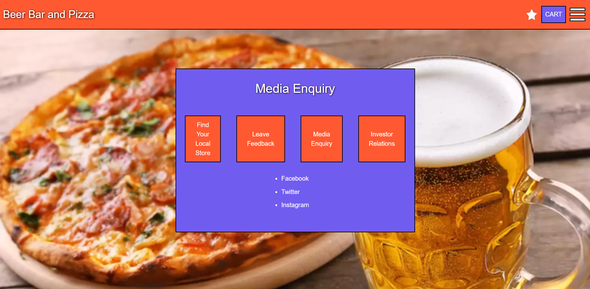
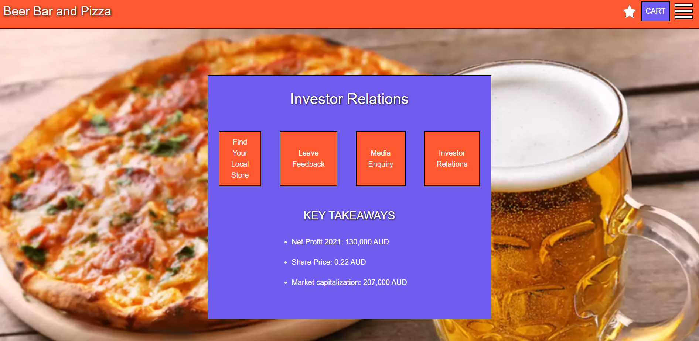
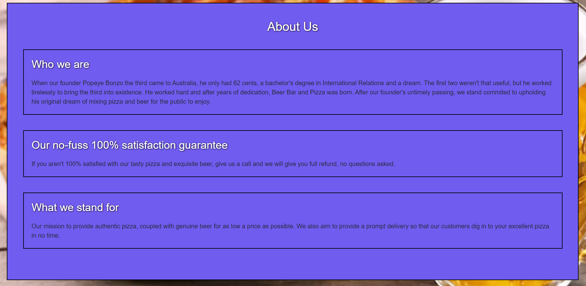
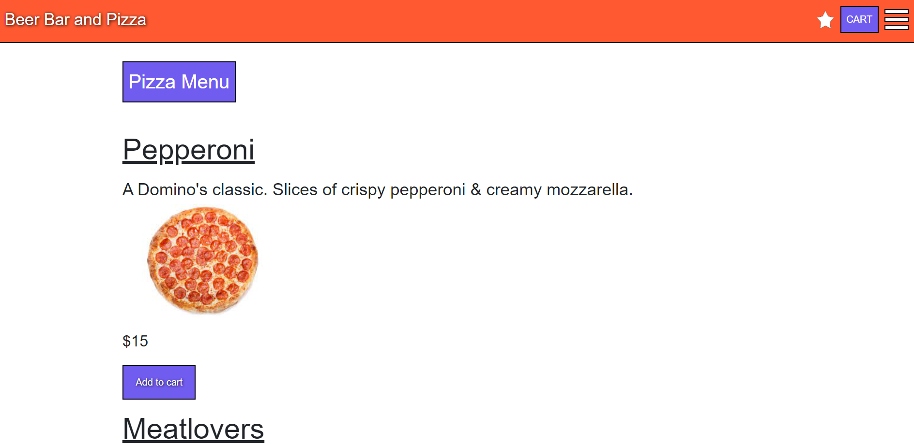
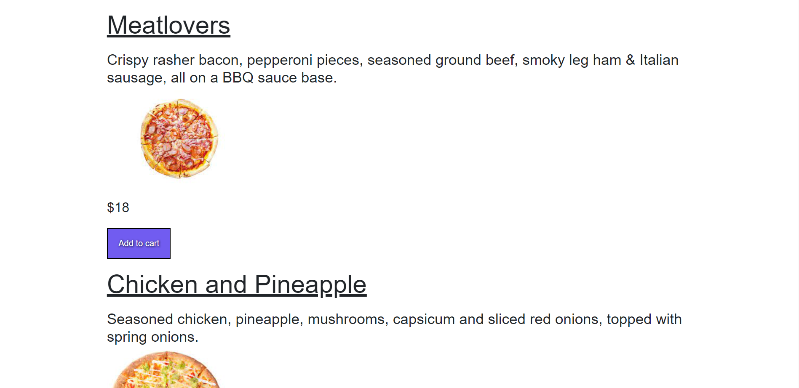